# Centrifuge DIY
（Abstract..........) 
 
## [3/22(Tue)_Research about gears 1](#research_about_gears_1)
## [3/23(Wed)_Research about gears 2](#research about gears_2)
## [4/2(Sat) Protoype 1](#prototype_1)
## [4/3(Sun) Prototype 2](#prototype_2)
## [4/5(Tue) Feedback Part2 & LEGO Centrifuge?](#feedback_part2_&_lego_centrifuge)
## [4/6(Wed) Take-tombo Centrifuge?](#take_tombo_centrifuge)
## [4/7(Thu) Think More and Search LEGO parts](#think_more_and_search_lego_centrifuge)
## [4/8(Fri) Prototype 3　-- with LEGO!!](#prototype_3_with lego!!)
 
 
## Research about gears 1
### 3/22(Tue)

I was wondering how to mesh two gears vertically to make hand-cranked centrifuge. I Googled it, and got known that the type of gear that mesh vertically is called "bevel-gear"（in Japanese, *Kasa-haguruma* かさ歯車） 
 .
どうやったら歯車を垂直方向に噛み合わせることができるんだろうと思い（それができなければ遠心分離機が作れない）、ネットで調べてみる。垂直方向に組み合わさっている歯車は「かさ歯車」というらしい。 
 
### References & Notes 
・[https://monozukuri.sqcd-aid.com/日本の国でものづくり、ひとづくりを行いましょ/index-of-basic/28-1-introduction-of-gear/](https://monozukuri.sqcd-aid.com/日本の国でものづくり、ひとづくりを行いましょ/index-of-basic/28-1-introduction-of-gear/) 
・回転と力の伝わり方 
[https://www.mabuchi-motor.co.jp/motorize/teck/](https://www.mabuchi-motor.co.jp/motorize/teck/) 
歯車ABC 入門編 p.17 
[https://www.khkgears.co.jp/gear_technology/pdf/gearabc_a.pdf](https://www.khkgears.co.jp/gear_technology/pdf/gearabc_a.pdf) 
歯車の種類と動き 
[https://tutorials.shade3d.jp/歯車の種類と動き/post/2391](https://tutorials.shade3d.jp/歯車の種類と動き/post/2391) 
⇨軸と歯車が組み合わさったものは「ウォームギア」というらしい 
⇨ネットにデータがありそうなので探す。 
↓ 
[Makebotで検索（Search word: "worm gear"）](https://www.thingiverse.com/search?q=worm+gear&type=things&sort=relevant) 
⇨色々出てきた。 
・土台付き手回し歯車 
[https://www.thingiverse.com/thing:2791504](https://www.thingiverse.com/thing:2791504) 
・Worm Gear ウォームギア 
[https://www.thingiverse.com/thing:2480647](https://www.thingiverse.com/thing:2480647) 
・かなり遠心分離機に近い構造のものも見つかった。回転数はどれほどか。 
[https://www.thingiverse.com/thing:2170237](https://www.thingiverse.com/thing:2170237) 
・「Centrifuge」で検索をかけたところ、[電動ドリルに取り付けただけの遠心分離機](https://www.thingiverse.com/thing:4583027)を発見した。これはなかなかの代物。 
・手回し遠心分離機のデータを発見！これはかなり求めているものに近いのではないか。 
[https://www.thingiverse.com/thing:946640](https://www.thingiverse.com/thing:946640) 
・ブンブン駒型 
[https://www.thingiverse.com/thing:1946291](https://www.thingiverse.com/thing:1946291) 
 
わかったこと・・・一から設計するのはかなり骨が折れそうなので、すでに公開されている既存のリソースを有効活用し、できることならそれをアレンジするほうが、よっぽど簡単だと思われる。 
 
### Research about gears 2
### 3/23(Wed)
Modeling guide lecture 
・Movie: bevel-gear かさ歯車 
[https://img.youtube.com/vi/9XQ29WcXvPQ/0.jpg](https://img.youtube.com/vi/9XQ29WcXvPQ/0.jpg) 
 
Fusion360ではなく3DCADを使用 
 
・Movie: bevel-gear 2 かさ歯車その２ 
[https://www.youtube.com/watch?v=4XWLYM0b8FI](https://www.youtube.com/watch?v=4XWLYM0b8FI) 
 
こっちはFusion。英語で検索したら出てきた。見よう見まねでなんとか作れるだろうか。 
 
 
## Prototype 1
### 4/2(Sat)
To understand and speculate the works of gear, I thought about making prototype by assembling gears. 
 
とりあえずモデルを作ってみる。それがうまく動けば、3Dモデルソフトでその再現を目指したい。 
 
Therefore, I came back Akihabara!! 
 
 
I visited Sengoku Densho again. 
A variety of gears are soldon the 3rd floor. 
 
 
### What I bought
・[Spun gear (50 teeth, 1.0 module)](https://www.sengoku.co.jp/mod/sgk_cart/detail.php?code=8AGA-HGKC) ¥649 
・[Handle(40mm, 3.0module)](https://www.sengoku.co.jp/mod/sgk_cart/detail.php?code=4AZU-JFFG()  ¥682 
・Bevel gear (? teeth, 6.0 module) ¥490 
・[Pinion gear (14 teeth, 1.0 module)](https://www.sengoku.co.jp/mod/sgk_cart/detail.php?code=EEHD-0SDD) ¥363 
・[Screw rod](https://www.sengoku.co.jp/mod/sgk_cart/detail.php?code=4A8D-BJEG) (3mm*29mm) * 2 = ¥594 
・[Stainless shaft (6mm) ¥480 -> (5mm)](https://www.sengoku.co.jp/mod/sgk_cart/detail.php?code=EEHD-4L6A) ¥480 
 
Note: I couldn't find plate-shaped materials in Sengoku Densho that is suitable to fix gears. I should look it for other shops. 
 
### Additional items purchased
・[Screw rod (3mm*59mm)](https://www.sengoku.co.jp/mod/sgk_cart/detail.php?code=5A8D-CJEJ)  ¥396 
・Hexagon head nut(3mm) * 6 = ¥60 
・[Mini Glue](https://www.amazon.co.jp/アロンアルフア-EXTRA-ミニ×4-0-5g×4-04611/dp/B000IGRZ2W/ref=asc_df_B000IGRZ2W/?tag=jpgo-22&linkCode=df0&hvadid=222868425990&hvpos=&hvnetw=g&hvrand=13755070881471756200&hvpone=&hvptwo=&hvqmt=&hvdev=c&hvdvcmdl=&hvlocint=&hvlocphy=20636&hvtargid=pla-440365886762&psc=1&th=1&psc=1) ¥396 
・Clay（ダイソー）¥110 
・Cork Board（ダイソー） ¥110 
 
Note: I bought clay and cork board, as I thought it could be used as a foundation. 
 
Total amount: ¥4,676 
 
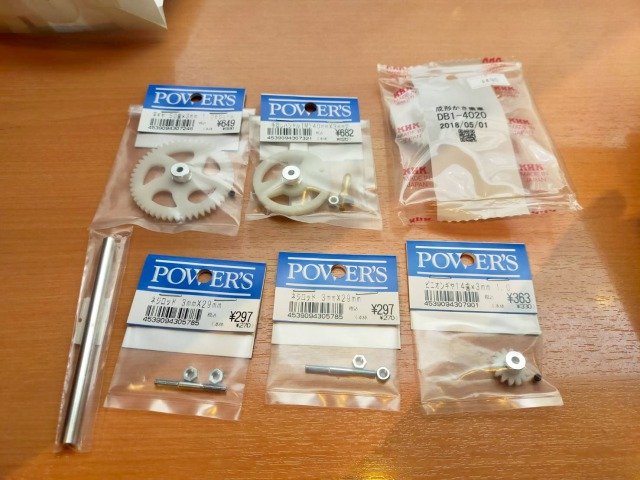 
 
Handle 
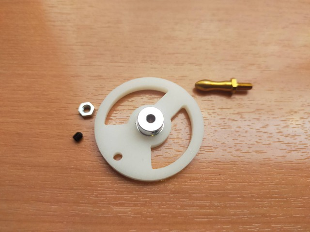 
 
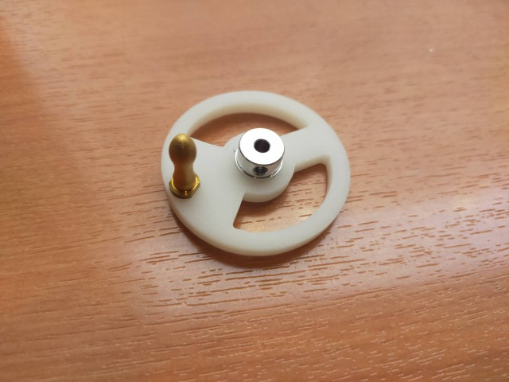 
 
Spun gear 
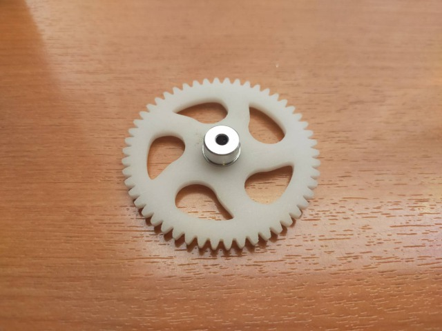 
 
Connect handle and spun gear with screw to move together. 
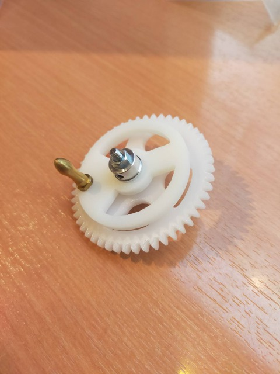 
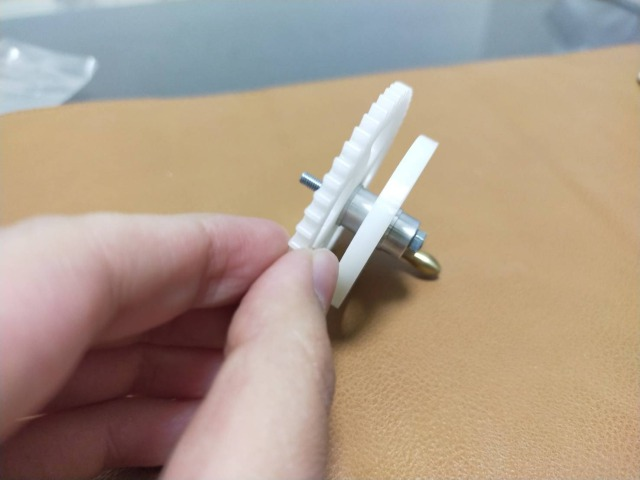 
 
Screw rod 
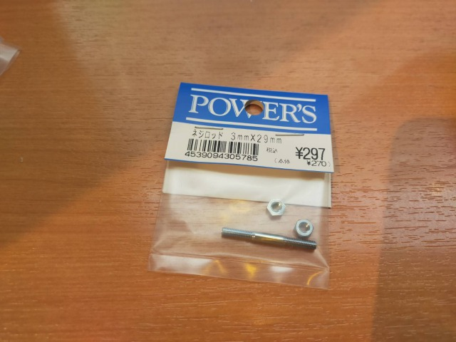 
 
Pinion gear  
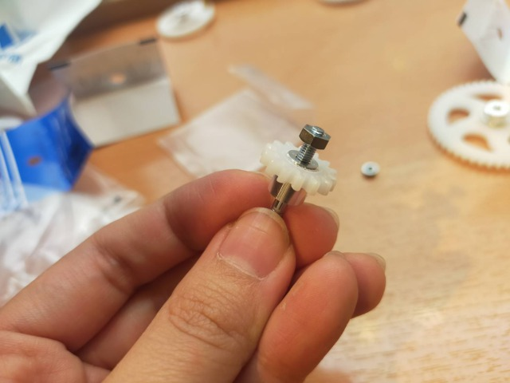 
 
Unfortunately, it appears that 6mm shaft is too big to fit after buying it. So, I had to go back the shop to changed it to 5mm. This time, however, it was still not match with the hole of bevel gear. I will have to deal with this problem later (fill a gap with something?). 
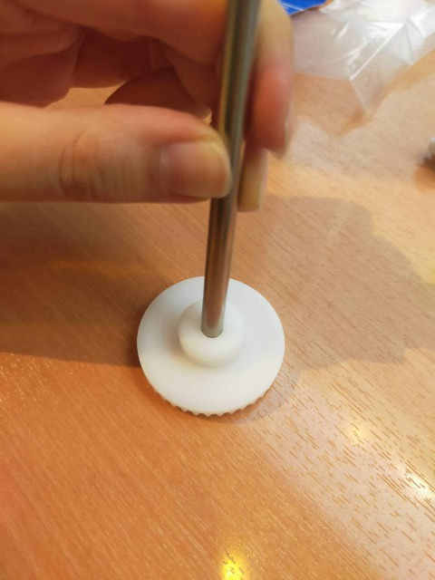 
 
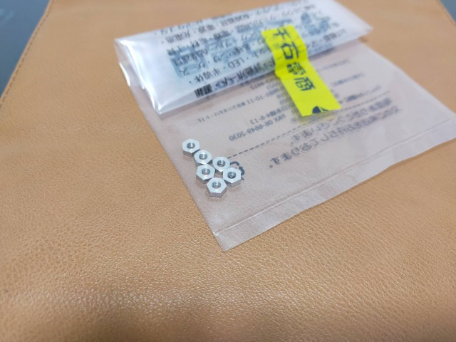 
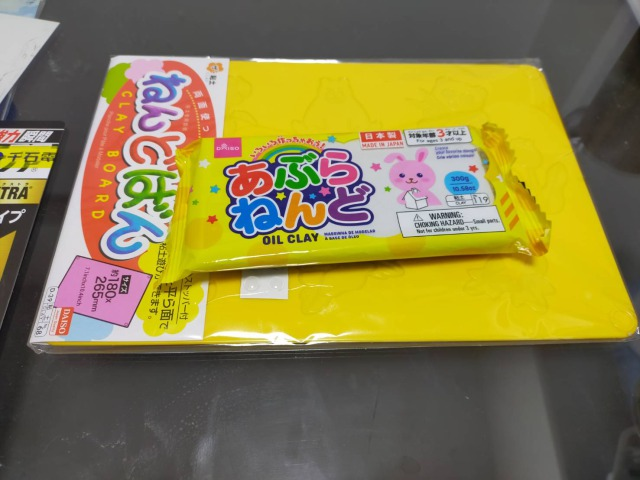 
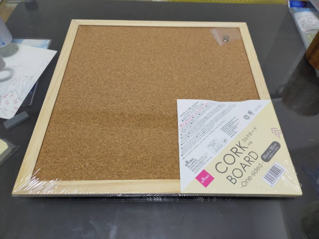 
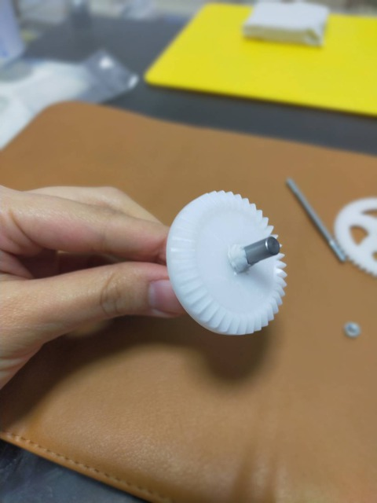 
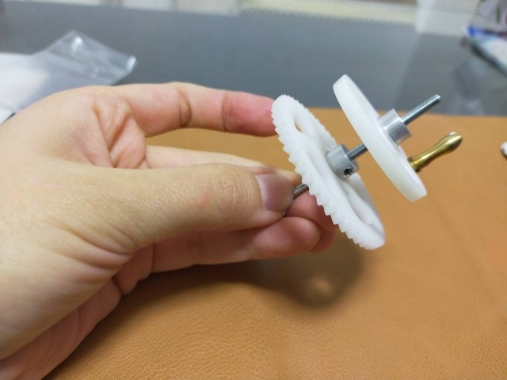 
 
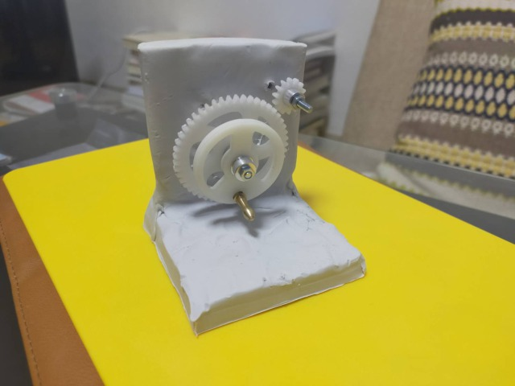 
 
My choice that using clay as foundation was entirely mistake, though it helped  to adjust the positions of each parts. It was too soft to fix the gears and polls... 
土台がよわよわすぎた……😭😭 
Therefore, I will make foundation with material which is harder next time. 
 
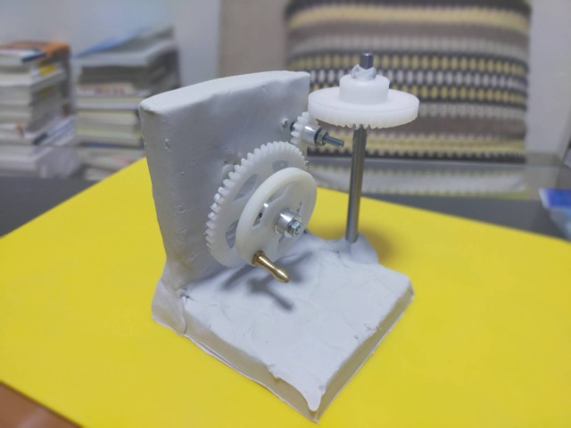 
 
Not working version (pinion gear and bevel gear are not meshing well) 
.gif) 
 
After adjusting the height of the bevel gear, then it worked (just a little bit...). 
.gif) 
Anyway, it was good to know that the gears' teeth are meshing and able to move, even though it moved awkward. 
 
Radio controlled car centrifuge? 
Maybe using motor-kits for radio controlled car is easier...? 
However, I will try to make hand-cranked centrifuge firstly as challenge.
 
こっちを使ったほうがよっぽど早いのでは、という誘惑（3000円くらいだし）……。しかしひとまずは一から作ることに挑戦してみたい。 
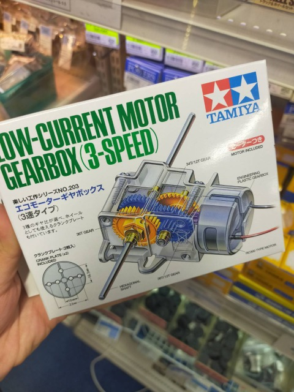 
 
**Reviews & Tasks** 
・コルクボードで土台を作ってみる。もしそれがうまくいかなければ、別の素材を探す。 
・棒の隙間を埋める 
・今の歯車の数では回転数がかなり遅いと思われる。より速い回転を得たければ、もっと歯車の数を増やす必要がある。 
・ハンドルが小さくて回しにくいので、これも改良したい。 
 
備忘録
・もはや何でも遠心分離機に見えてきた 
・だんだん部品の名前を覚えてきた。ウォームギア、かさ歯車、シャフト etc... 
・歯車の仕組みを理解することや、さまざまな種類があるのが面白くて、歯車にはまってきた。ただ、あまり歯車自体に夢中になると本来の目的を忘れそうなので、程々に。 
 
・Make foundation by cork board. If it fails, I will look for other materials. 
・The rotation speed of above model which has a few gears seems to be very slow. If I want it to be faster, it is necessary to use more gears.  
・The handle is too tiny to handle. I want to improve this point.  
 
**Memo** 
・I became to see everything around me which is able to spin and with gears as usable for centrifuge. I felt interesting in such change of my point of view. 
・I have memorized some of names of gears and parts: worm gears, bevel gears, shaft, etc. 
・I have been hooked on gears because I find it interesting to understand how they work and the different types of gears. I should careful not to dedicate too much to only gears because my main purpose is replicate/recreate classic-style centrifuges, not learning gears itself! 
 
 
## Prototype 2
### 4/3(Sun)
Place: FabCafe Material 
Took about 2 hours 
 
 
 
Yesterday I made a big mistake using clay as a foundation, so today I tried DIY again with a cork board. As I thought it seems better than doing it at home, I did it at FabCafe MTRL that has variety of making tools. 
Cork board is affordable material for cutting and making a hole. It was easy to deal it.
 
 
**Reviews & Tasks** 
・安定感が大事 
・土台と歯車＋軸の関係性がよく分かっていない。スムーズに回らせるにはどうしたらいいか？ 
 
・The important point is its stability. 
I have not understood the connection between foundation and gears, and gears and axes. I wonder how can I spin gears smoothly. 
 
**DIY process** 
 
コルクボードを木枠から切り抜く 
Cut cork board from the wood frame. 
 
 
土台に適当な大きさの板を作る。カッターでコルクを切る。 
Cut cork board and make adequate-size plate with a cutter. 
 
 
上の板：縦9×横10cm、下の板：奥行き9×横10cm 
下の板は薄っぺらかったので、同じ大きさのを２枚重ねてボンドで貼り合わせた。 
Top plate... Width:9cm Depth 10cm 
Fountdation plate... Width 9cm Depth 10cm 
 
Because the foundation plate was so thin, I glued a same-sized cork board to it. 
 
 
 
 
Determine the position of the gears, and make holes with drill. 
To drill the cork board was so easy because of its softness.  
歯車の軸を通す位置を決め、キリで穴を開ける。コルクなので穴を開けるのは簡単だった。 
 
 
 
コルクボードに歯車をとりつける。 
Fix the gears (strictlly speaking, connected gear and axis) on the cork board. 
 
 
上下の板をどうやって一致させるかを考えていなかった。 
最初はコルクボードの端切れを使って支えにできるかと思ったが、元々の薄さがかなり薄いのであまり補強にならないと分かる。そこで、使うつもりのなかった余りの木枠をノコギリで小さく切って棒状にして、木工ボンドで下の板に貼り付けた。するとそれなりにうまくいった。 
I had not considered how to fit the top board(?) and the foundation. 
At first, I thought that the leftovers of cork board could be used for supporting, but it appeared that it was not helpful because the cork board was thin. Therefore, I cut the wooden frame -which I had not intended to use- into small sticks to support the foundation. Then, it worked reasonably well. 
 
This picture shows I am completely DIY layperson! 
どっからどう見ても素人の手つき。腰が引けている。 
 
 
 
Combine all. 
 
 
 
 
 
歯車の噛み合いも問題なし。 
ただ、軸の部分がネジなので、回せば回すほどネジが締まっていき、歯車の位置が次第に変わってしまうという問題が発生した。最終的にハンドルが動かせなくなってしまう。 
↓ 
ネジではなく、丸い棒を軸として使ったほうがよい？ 
　その場合、歯車はどうやって軸に固定させるのか？ 
There was no problem of mesh between these two gears. 
However, since the shaft parts were screws, the problem occurred that the more it was turned, the tighter the screw became and the position of the gear gradually changed. Then, the handle became stuck eventually. 
↓ 
Is it better to use round sticks as shafts? 
In that case, how to fix a gear on certain position of a shaft? 
 
 
 
 
木の支えがちょっと心もとなかったので、マスキングテープで補強。 
Since I was worried about the bound between the wood sticks and the foundation, I reinforced it with masking tape. 
 
 
かさ歯車も取り付けたかったけれど、薄いコルクにシャフトを取り付けるのが難しそうだったのと、かさ歯車とシャフトのの隙間を埋める方法をまだ思いつかなかったので、この日はここまででギブアップ。ただし前回よりは形になったと思う。 
I wanted to add a vebel-gear to this, since it seemed difficult to attach the shaft to the thin cork and I had not yet figured out how to fill the gap between the bevel gear and the shaft, I gave up at this point for the day. 
But I think it was better than the last prototype! 
 
## Review & Advises
### 4/4(Mon)
### Technical Advises
I was given many fruitful advises by the other members. 
(Thanks a lot, Georg-san and Tsuchiya-san!!) 
 
・Change screw（ねじ） that I used as axes to shafts(simple round sticks). 
・Sandwitch gears with two plates? to make axes stable. 
・Put gears not on single side but on both sides for balancing. 
・Fix gears to shafts with "Imoneji 芋ねじ" (a tiny screw). 
 
Book:[伊藤茂『メカニズムの事典』（Shigeru Ito, Encyclopedia of Mechanisms）](https://www.amazon.co.jp/メカニズムの事典-伊藤-茂/dp/4274069648/ref=asc_df_4274069648/?tag=jpgo-22&linkCode=df0&hvadid=280512638360&hvpos=&hvnetw=g&hvrand=15566208541528392394&hvpone=&hvptwo=&hvqmt=&hvdev=c&hvdvcmdl=&hvlocint=&hvlocphy=1009308&hvtargid=pla-525315917511&psc=1&th=1&psc=1) 

### Feedback from others
・It is necessary to add something "+α" to my ideas. ⇨**WHAT??** 
（・・・・・・・・・・・・・） 
 
## Feedback Part2 & LEGO Centrifuge?
### 4/5(Tue)
・再現するだけでは面白くない（ゲオルグさん） 
・タケコプターみたい（ミサさん） 
・昔の遠心分離機を参考に遠心分離機の仕組みを理解し、その理解によって遠心分離機にアレンジを加えられると面白いのではないか（ミサさん） 
・ゲオルグさん案：LEGOでプロトタイプ　歴代の遠心分離機をLEGOで再現する 
・ベルト式にするという案（ゲオルグさん） 
・使えるものにするかどうか（私は使えるものにしたい） 
・アナログなものにこだわりたい 
・LEGOを貸してもらったので、これで一度プロトタイプ第三弾を作ってみるつもり。 
 
## Take-tombo Centrifuge?
###4/6(Wed)
ミサさんが初期の遠心分離機がタケコプターみたいだと言ったのと、岩崎先生とゲオルグさんから、何かプラスアルファがあるといいと言われたので、空を飛ぶ遠心分離機はどうか。 
 
イメージ 
 
 
"Super Take-tombo" スーパー竹とんぼ 
How to make a Take-tombo that fly well from bamboo.
[https://www.youtube.com/watch?v=_r4aK2asVog](https://www.youtube.com/watch?v=_r4aK2asVog) 
 
"A mechanical launch pad" 竹とんぼ発射台装置 
[https://www.youtube.com/watch?v=t1t1HYFW4UA](https://www.youtube.com/watch?v=t1t1HYFW4UA) 
...Too mechanical. It is abviously too advanced for me to make the copy. 
 
→I rejected this idea.
 
## Think More and Search LEGO parts
### 4/7(Thu)
・OMG, there is bicycle centrifuge in the world!! 
・自転車を利用した遠心分離機は既に存在した（存在することにびっくりした） 
[A Clever Bike-Powered Centrifuge for Developing Countries](https://www.wired.com/2014/12/clever-bike-powered-centrifuge-developing-countries/) 
 
ゲオルグさん案 
・自転車ダイナモ・・・自転車の車輪に直接チューブを取り付けるより速度が高い 
・人力車？？ 
 
・レゴのパーツをどのようにして手に入れるか 
・候補：メルカリ、Amazon、LEGOサイト、LEGOショップに直接、ホビーオフ 
・科学者のフィギュアをつけたい 
・みんなをモデルにした科学者フィギュアを作る（ゲオルグさん案） 
・バイオラボをレゴで作る？（面白いが別プロジェクトになりそうなので保留） 
 
## Prototype 3 with LEGO!!
###4/8(Fri)
I haven't used Fusion360 since Week3. I have to practice it. 
 
借りたレゴでプロトタイプ3号機を制作した。 
 
**Reviews & Tasks** 
（携帯のメモそのまま。あとで翻訳・・・・・）br/>
・やはり、小さい車輪を繋ぎ合わせるだけでは回転数が少ない。大きい歯車が欲しい。 
 
・チューブロットのような形をしていたのでよさそうだと思い、メガホン型のパーツを付ける。 
 
・横回転から縦回転のやり方がまだわからない 
→次回はウォームギアバージョンを作るところまでやりたい。 
　 
・ハンドルが小さすぎて回すの疲れる。十秒くらいで疲れた。 
→ハンドルを大きいのに変えた。しかし、意外とこれも扱いづらい。すっぽ抜けてしまう（ハンドルが大きいからというよりは、持ち手が小さいから）。結果的にはどっちもどっちだと分かった。 
 
→もっと丈夫で太いハンドルがいい。ただそうするとレゴの穴の大きさも大きい方が強度的には良さそう。そこをどうにかするのは難しそう。 
・長さは今ある大小のハンドルの中間くらいのサイズがよいかも。 
 
・あと、チューブロットの部分をプロペラ版に付け替えて試してもみた。メガホン的パーツよりプロペラのほうがよさそう。後者のほうが速く回っていそう。 
 
・最終的に、ゲオルグさんが作ったのと似たようなものになった。 
 
・プロペラ部分がゆるい（回転がしっかり伝わっていない） 
→連結パーツの見直し 
 
・あと、しっかりした土台の重要さも分かった。レゴはプラスチックで軽いので、土台としては軽すぎるかもしれない。どう改良できる？ 
すべりにくくするものを下に敷くなど。 
 
→手回し式の弱点はブレにある？ 
→……だから昔の遠心分離機は万力のような台を挟み込むやつが付いてたのかなぁ。 
 
・やはり速度が遅く感じる。これで何かが分離できる気がしない。牛乳でも無理そう。 
 
・とりあえずもっと大きい歯車パーツが欲しい。ネットで買おうかな。 
 
・モーターを付ければ速いんだろうけど、できればやりたくない……。あるいはモーター版（より新しい時代のモデル）も作って両者を比較する？ 
 
・手回し型の大変さ（デメリット？）が明らかになってきた。何よりも疲れる！！！ 
　1分も回せる気がしない。やはり電力は正義なのか……。 
 
・あと、ゲオルグさんが言っていたように、歯車が何枚も重なると摩擦が大きくなる。大きな歯車を使えばある程度解決できるか？あるいはベルト式にするか。 
 
最終的なマイナーチェンジ 
・補強のため、細長いレゴの列の隙間を別のレゴで埋めた 
・一段高くした 
・プロペラを長くした 
 
次回やりたいこと 
・土台の安定を目指す 
・大きな歯車を買って、回転数を上げる 
・ウォームギアをつけて縦回転に 
・ハンドルの改良（持ち手にゴムを付けるなど） 
（可能性としては、ベルト式も） 
 
 
・LEGOブロック専門店　Brickers 
パーツをバラで購入可できる 
[https://www.brickers.jp](https://www.brickers.jp) 
 
 
 
 
