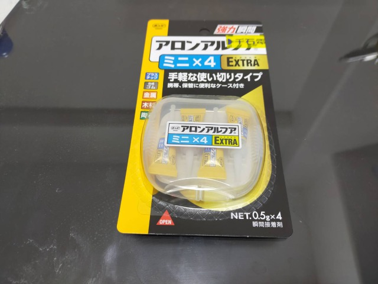

# Final Project

リサーチャーなので、調査をベースとしたものにしたい 
 
## Ideas and keywords
3/18 
**Mobility** 
I'm interested in the challenges in DIYbio to make laboratory mobile. 
Go outside from laboratory 
Now, the inside/outside of laboratory is spacially separated. 
 
Inspirations 
・Suitsucase laboratory by Urs (GaudiLab) 
・BentoLab by Philip 
・屋台ラボ 
 
👉Can scientists be free from their laboratory? 
👉Can scientists go travel over the world with mobile scientific tool-kit? 
 
・地元、富山の薬売り　箱状のリュック、持ち運べる箪笥のようなもの 
・蟲師の箱的な 
→売り歩く。何かを？　バイオ系の行商人みたいな人がいたら面白いんじゃないか 
細胞とかを持ち運べないか 
 
Reference: [「置き薬の歴史」](https://www.zenhaikyo.com/history/) 
 
 
 
**History** 
I want to put historical elements of science into my final project. 
I'm interested in not only the brand-new science but also the historical side of science, especially the improvement of scientific tools. I would like to represent classic scientific tool or reinvent them. 
 
### History of Incubator
[Wiki page](https://en.m.wikipedia.org/wiki/Incubator_(culture)) written about incubator is interesting. 
 
I am surprised that incubator has long history. At the same time, I'm interested in the multiplicity in the use of it. 
 
I thought that incubator is the machine that helps cell culture.But not only in science, it has also been used in medical purpose.  
 
To begin with, incubator is not intended for scientific purpose. The earliest incubators were used for warming chicken eggs in ancient Egypt and China.  
In the 17th century, a entomologist Rene-Antoine Ferchault de Reaumur invented more sophisticated incubator. Reaumur made the incubater with a wood stove.  
 
 
 
In 19th, incubator began to be used for culturing cell. Moreover, doctors found that it could be apllied to keep premature infants alive.  
Later, an American physician Julius H. Hess created the first electric infant incubator. 
 
I was fascinated the history of incubator. I think there is a keyword = "care": caring baby and caring cells.  
 
👉Infant-incubator-formed incubator for cell culture? 
 
### Centrifuge
Classic design of centrifuge (1941, made by Shimazu Seisaku-sho) 
 
 
 
 
**References**
 
[・『島津化学器械目録』（1941）200号](https://dl.ndl.go.jp/info:ndljp/pid/1875752) (From National Diet Library Digital Collections) 
[・『島津化学器械目録』（1936）300号](https://dl.ndl.go.jp/info:ndljp/pid/1172650) 
[・「光学顕微鏡の技術系統化調査」(PDF)](https://dl.ndl.go.jp/view/download/digidepo_11546712_po_101.pdf?contentNo=1&alternativeNo=) 
[・Evolution of the Laboratory Centrifuge (PDF)](https://cdn2.hubspot.net/hubfs/547446/LabManager/Downloads/Infographics/Centrifuge/LM_Centrifuge_Infographic-2017-final.pdf?t=1501057410560) 
[・『医療筌蹄. 上巻 』(1897)](https://dl.ndl.go.jp/info:ndljp/pid/833119/20?tocOpened=1) 
ヘルマン・リーデル 著[他] (南江堂) 
The author introduces a centrifuge (called "Steenbech-Litten Centrifuge") made by Germany. The mechanism of the centrifuge is explained in detail.  
 
 
p.219 
「スチーンベック、リッテンの遠心分離機（Steenbech-Litten’sche Centrifuge）は特に尿を速かに沈澱せしめ、之に依て診断を速定し得るの目的にて案出せしものなり。／此器械は手柄を装せし曲柄（a）に依て廻転せられ、而して歯輪伝搬の作用に依て需要の回転速力を得るものに＊青銅色の台上に鋼鉄円柱ありて之に二個の硝子管（cc）を有する遠心分離臀（b）を附せり。／小硝子円筒（第百二十六図）は此器械に供用すへき液を入るるに充て且つ硝子/p.220/の破裂に於けるか如き不慮の事変を予防せん為め金属鞘（第百二十五図　c）の中に包容す。／器械の安置し在るときは硝子円筒及ひ金属鞘は横棹の両端に於て鉛直に懸吊し、器械の動作を＊なむときは金属鞘と硝子円筒は一個の間接中に運動し得るを以て高挙せられて、第百二十五図の點線を以て仮示せるか如く横棹と同方向即ち地平の方向を取って振動す、此際液を充填（漢字）しある円筒硝子の其基底は一圏の周辺を描き其中心を横棹の中央に在す、此遠心力に依って液中の固形分即ち最も重き成分は圏の最外部即ち硝子円筒の基底に向/p.221/つて駆逐せらる而して既に全く固形文を沈澱するの后は之を吸液菅に取りて顕微鏡的及ひ化学的に固形分の検査に着手すへし。（以下略）」 
 
[1951年のクリーンベンチ（毎日新聞）](https://photobank.mainichi.co.jp/kiji_detail.php?id=P20130813dd1dd1phj322000) 
 
### 3/22(Tue)
どうやったら歯車を垂直方向に噛み合わせることができるんだろうと思い（それができなければ遠心分離機が作れない）、ネットで調べてみる。垂直方向に組み合わさっている歯車は「かさ歯車」というらしい。 
・[https://monozukuri.sqcd-aid.com/日本の国でものづくり、ひとづくりを行いましょ/index-of-basic/28-1-introduction-of-gear/](https://monozukuri.sqcd-aid.com/日本の国でものづくり、ひとづくりを行いましょ/index-of-basic/28-1-introduction-of-gear/) 
 
・回転と力の伝わり方 
[https://www.mabuchi-motor.co.jp/motorize/teck/](https://www.mabuchi-motor.co.jp/motorize/teck/) 
 
歯車ABC 入門編 p.17 
[https://www.khkgears.co.jp/gear_technology/pdf/gearabc_a.pdf](https://www.khkgears.co.jp/gear_technology/pdf/gearabc_a.pdf) 
 
歯車の種類と動き 
[https://tutorials.shade3d.jp/歯車の種類と動き/post/2391](https://tutorials.shade3d.jp/歯車の種類と動き/post/2391) 
⇨軸と歯車が組み合わさったものは「ウォームギア」というらしい 
⇨ネットにデータがありそう。探す。 
↓ 
Makebotで検索（worm gear） 
[検索結果](https://www.thingiverse.com/search?q=worm+gear&type=things&sort=relevant) 
色々出てきた。 
 
・土台付き手回し歯車 
[https://www.thingiverse.com/thing:2791504](https://www.thingiverse.com/thing:2791504) 
 
・ウォームギア 
[https://www.thingiverse.com/thing:2480647](https://www.thingiverse.com/thing:2480647) 
 
・かなり遠心分離機に近い構造のものも見つかった。回転数はどれほどだろう。 
[https://www.thingiverse.com/thing:2170237](https://www.thingiverse.com/thing:2170237) 
 
・「Centrifuge」で検索をかけたところ、[電動ドリルに取り付けただけの遠心分離機](https://www.thingiverse.com/thing:4583027)を発見した。これはなかなかの代物。 
 
・手回し遠心分離機のデータを発見！これはかなり求めているものに近いのではないか。 
[https://www.thingiverse.com/thing:946640](https://www.thingiverse.com/thing:946640) 
 
・ブンブン駒型 
[https://www.thingiverse.com/thing:1946291](https://www.thingiverse.com/thing:1946291) 
 
わかったこと・・・一から設計するのはかなり骨が折れそうなので、すでに公開されている既存のリソースを有効活用し、できることならそれをアレンジするほうが、よっぽど簡単だと思われる。 
 
### 3/23(Wed)
・動画　かさ歯車 
 
Fusion360ではなく3DCADを使用 
 
・動画　かさ歯車その２ 
 
こっちはFusion。英語で検索したら出てきた。見よう見まねでなんとか作れるだろうか。 
 
 
### 4/1(Fri)
History of centrifuge 
[https://youtu.be/Q3CSUfjfgus](https://youtu.be/Q3CSUfjfgus) 
 
The origin of centrifuge that was developed for milk separation. 
A Swedish engineer invented the first centrifuge in 1880s in order to help cattle farmers to separate fresh cream from milk. 
 
"How to work centrifuge basic principe" 
[https://youtu.be/nX0NNfV8nWw](https://youtu.be/nX0NNfV8nWw) 
 
 
### 4/2(Sat)
To understand and speculate the works of gear, I thought about making prototype by assembling gears. 
 
Therefore, I came back Akihabara!! 
 
 
I visited Sengoku Densho again. 
A variety of gears are soldon the 3rd floor. 
 
 
**What I bought**
・Spun gear (50 teeth, 1.0 module) ¥649 
・Handle (40mm, 3.0module) ¥682 
・Bevel gear (? teeth, 6.0 module) ¥490 
・Pinion gear (14 teeth, 1.0 module) ¥363 
・Screw rod (3mm*29mm) * 2 = ¥594 
・Stainless shaft (6mm) ¥480 -> (5mm) ¥480 
 
※ Since it appears that 6mm shaft is too big to fit after buying it, I changed it to 5mm.) 
※ I couldn't find a plate in Sengoku Densho that is suitable to fix gears. I should look it for other shops. 
 
**Additional items purchased** 
・Hexagon head nut(3mm) * 3 = ¥60 
・Mini Glue ¥??? 
・Clay（ダイソー）¥108 
・Cork Board（ダイソー） ¥108 
 
※ I bought clay and cork board, as I thought it could be used as a foundation. 
 
 
 
 
 
 
 
 
 
 
 
 
 
 
 
 
 
 
 
My choice that using clay as foundation was wrong entirely. It was too soft to fix the gears and polls... 
土台がよわよわすぎた……😭😭 
Therefore, I will make foundation with material which is harder next time. 
 
 
.gif) 
.gif) 
 
 
 
 
