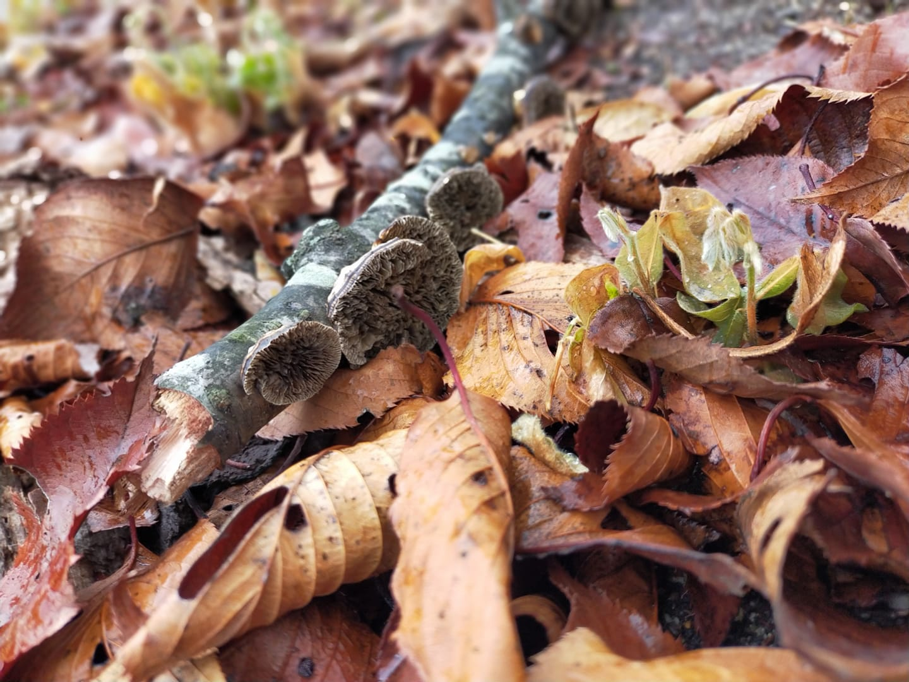

# Profile

## Mariko Sakuragi

I am a doctoral student at Osaka University, focusing on medical anthropology and STS. My doctoral project is about current citizen science movement in Japan. Particularly, I examine the DIY biology movement, investigating the DIY practices regarding biotechnology and new understandings of technology by sharing and circulation of tools. My interests also include the new human-nonhuman relationships forming by way of these movements.
 
[Researchmap](https://researchmap.jp/marikosakuragi)
 
---
# Week1
 
### Homework
#### What is Life? How would you define it, can you actually define it?

#### What is BioHacking? What does it mean for you?

#### Why are you interested in Bio?
1. I am interested in Bio because bio is fundamental of nature, bodies, and our lives. At the same time, bio is full of mystery like the universe which is endless, and nobody has never saw the end. That is the reason Bio has a gravity that attracts people for centuries.（...）

2. As symbolized by the DIYbio, various people has try to joining to know and do biology in this decade. I am curious about why Bio fascinates people, and how forms of Bio might transform in near future.

3. The story may goes away, I am also interested in the cultural and social power of biology. What is regarded as "right" (facts, tools, therapies etc. ) has changed/would change as time passed, and that always has influenced on how people live. Biomedicine not only improve treatments, it give birth the sociality like patient groups. It can go wrong by making categorization of people that could cause restriction or discrimination. So, I would like to know the boundary-making by Bio and the interactions of Bio and people.
