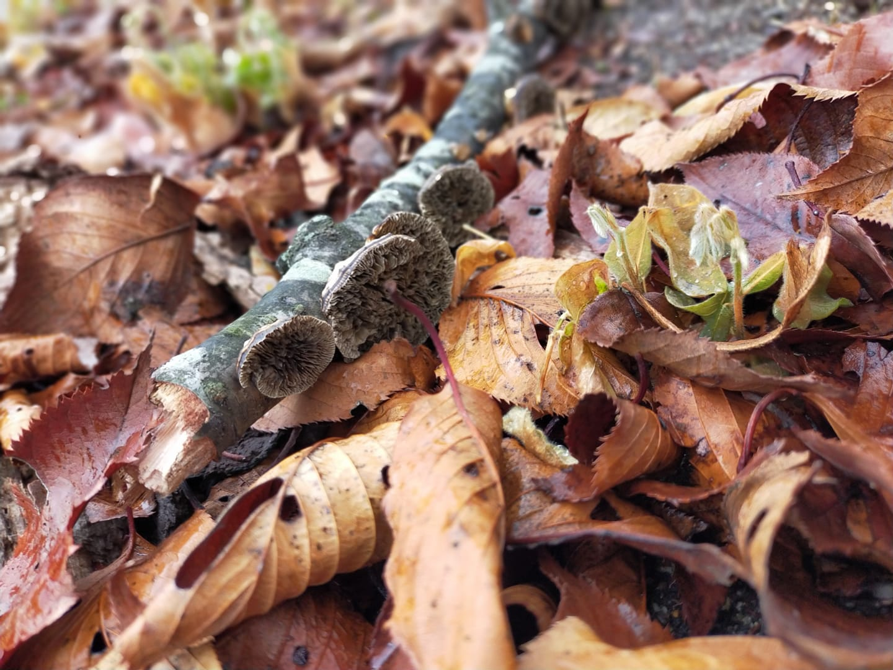

# About me
## Mariko Sakuragi
I am a doctoral student at Osaka University, focusing on medical anthropology and Science and Technology Studies (STS). My doctoral project is about current citizen science movement in Japan. Particularly, I examine the DIY biology movement, investigating the DIY practices regarding biotechnology and new understandings of technology by sharing and circulation of tools. My interests also include the new human-nonhuman relationships forming by way of these movements.  
[Link to Researchmap](https://researchmap.jp/marikosakuragi)  
