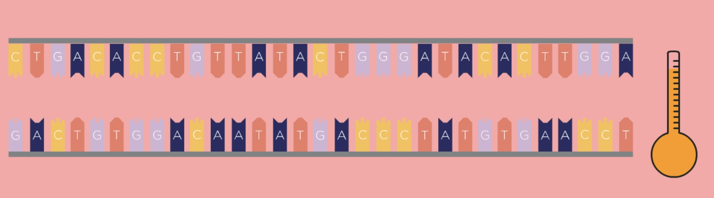

# Week 10: PCR Experiments

## Bento Lab
 
 
 
 
Bento Lab Biotechnology 101 Kit 
[https://bento.bio/protocol/biotechnology-101/](https://bento.bio/protocol/biotechnology-101/) 
 

## DNA Extraction (From Saliva)
1. 1.5ml Salva and label name on tubes 
 
2. Put pinch of salt into cup with water 
 
 
3. Gargling(30-60sec) 
 
4. Transfer 3. to 1.5ml tube 
 
 
5. Centrifuge(4,000G, 90sec) 
 
 
 
CAUTION: Be careful to the balance of tubes. It is dangerous if these are not put in the tube rod in well-balanced. 
 
6. Remove supernatant by decanting 
 
 
 
7. Resuspend and flipping 
 
 
Flip near the bottom of the tube with your finger. 
It is also OK to thump it on the table. 
 
8. Transfer 7. to 200μl to PCR tube and label it. 
 
 
19. Heating these tubes in thermocycler of Bento Lab(90℃, 10sec) 
 
 
10. Mix by flipping 
 
11. Centrifuge(8000G, 90sec) 
 
 
12. Transfer supernatant to new PCR tube 
 
 

## Introduction to PCR
[Reference](https://bento.bio/protocol/biotechnology-101/introduction-to-pcr/) 
 
**Equipment** 
- Bento lab only 
 

### Guide
#### 1. What is PCR
PCR (polymerase chain reaction) is a method used in molecular biology to make millions of physical copies of a specific DNA sequence, for example, a gene. 
 
**"Primer"** is **a short single strand of DNA that serves as a starting point for DNA synthesis of a new DNA strand**. It is required for DNA replication because the enzymes that catalyze this process, DNA polymerases, can only add new nucleotides to an existing fragment of DNA. 
 
1. First Step: Denaturing 
 
 
 
First, the DNA template is heated, which causes the double-stranded DNA to separate into two single strands. 
 
2. Second Step: Annealing 
 
 
 
40-60℃: annealing temprature 
At this point, the primers will attach, or anneal, to their binding positions on the single strands of the template DNA. 
 
3. Third Step: Extending 
 
 
 
In the next step, the reaction moves to an optimal temperature for the polymerase enzyme (1), from which PCR takes its name, to start working. The polymerase enzyme builds DNA strands, and it will extend the DNA from the primer along the DNA template, creating a new DNA strand, which combines with the single-stranded template to form a double strand. The polymerase enzyme uses dNTPs (2), free DNA nucleotide bases as the building blocks for the new strand. 
 

#### 2. PCR on Bento Lab
 
#### 3. PCR with Biotechnology 101 Kit
For all experiments using PCR in the Biotechnology 101 Kit, you will be provided with a specific set of primers. (1) 
 
In the 101 kit, there are PCR tubes with a freeze-dried PCR master mix bead (2). This bead contains: 
- Taq Polymerase, the enzyme which performs the reaction. 
- dNTPs (DNA nucleotide bases). These are the DNA bases (A, C, G and T) that are the building blocks of DNA. They are used by the polymerase to construct the new DNA copies. 
- Buffer to ensure the right conditions for the reaction. 
 
Finally, you will prepare, as part of each experiment, specific template DNA (3). These need to be mixed in precise proportions, for which you will need the micropipette (4). 
 

## Gel Electrophoresis
[Reference](https://bento.bio/protocol/biotechnology-101/introduction-to-gel-electrophoresis/) 
 
**Consumables** 
- 4 x Pipette Tips 
 
**Equipment** 
- Micropipette  
- Bento Lab 
- Microwave 
 
**Reagents and Consumables** 
- Pipette Tips (4) 
- Gel Electrophoresis Tutorial Bag 
- Electrophoresis Materials Bag 
- Distilled or deionized water (1L) Not included. You can find this on eBay or Amazon. 
- Empty 1L plastic or glass bottle. Not included. 
 

### Guide
#### 1. What is Gel Electrophoresis?
Gel Electrophoresis is a common analysis method of DNA and it’s the key to visualising your results. 

#### 2. The Gel Box
The orange lid (1) seals the gel box when the voltage is applied and also functions as a filter for the transilluminator, to render the fluorescing DNA visible.The base (2) is used to cast and run the gel. It has the red positive electrode, and the black negative one. Each of the electrodes is made of a thin platinum wire. 
 
Two rubber dams are used to create buffer zones around the electrodes during gel casting (3). There are also combs to create 9 and 12 well gels (4). 
 

#### 3. Buffer Solution
 
#### 4. Mixing the gels
 
#### 5. Preparing the gel box for casting
 
#### 6. Heating the gel solution in the microwave
Heat the solution in a microwave for short bursts of 20-30 seconds. 
**!** Avoid heating the gel solution for too long. 
 
After each burst of microwaving, take our the beaker and swirl the solution. Once bubbles start appearing, the agarose should have dissolved. If you still see visibly solid pieces or strings of agarose, continue until they are dissolved. 
 
#### 7. Pouring the gel
Once the agarose is fully melted and dissolved, let it cool to about 55°C – it should feel hot, but not too hot to touch. 
Pour the agarose **slowly** into the gel box until the 5mm mark. 
 
It will take about 30 min for the gel to solidify at room temperature. To speed up the process, you can also put the gel tray into the fridge. 
 
#### 8. Removing the comb and buffer dams
Remove the comb and the buffer damsafter the gel has solidified. 
 
**!** Be careful not to damage the gel as you remove the comb and dams. When removing the comb, make sure not to pierce the gel. 
 
#### 9. Gel Buffer
Use your prepared 0.5X TBE buffer solution again, and pour it over the gel until the gel is fully covered. The buffer should reach about 2-3mm above the gel. 
That is all of preparing the gell. 
 
#### 10. Loading the gels
 
#### 11. Running the gel
 
#### 12. Results
 
