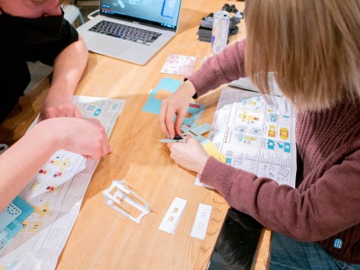

# Week2: Deconstruction/Construction of Hardware

## 3/8(Tue) Foldscope, Pocket PCR
#### Participants: Georg, Tsuchiya, Yokogawa, Sakuragi
 
### 1. Making Foldscope
We assmbled Foldscope from the kit, and do observation. 
#### - About Foldscope
Foldscope is a small and low-cost microscope made by paper. It was designed by Manu Prakash, a Professor of Oxford University. He developed Foldscope by hoping to make microscope more accessible for children in developing countries such as India. <u>[Foldscope Website](https://www.foldscope.com)</u> 

#### - Contents
 
 
・Instruction manual 
・Parts of Assembly 
　・Main Parts: Lens stage, Sample stage, Panning guide, Focus ramp 
  ・Sub Parts: Slides, Coupler, Lens, Ring sticker, Covership stickers 
 
#### - How to make Foldscope
1. Tear off each parts along perforation. 
 
 
2. Place and insert coupler into center holes. 
 
3. Flip Lens Stage, put coupler into down holes. 
4. Turn back lens stage. Insert Focus ramp under the lens which is put at Step2. 
5. Assemple Sample stage and Panning guide 
（Causion: If you don't assemble them right, sample stage will not move.) 
6. Assemple 5. and Lens Stage. 
 
7. Finish! 
 
Let's check if you make correctly by sliding Panning guide and Focus ramp. If these are moved smoothly, it's done! Let's look through the microscope. 
 
#### - Observation
Foldscope's magnification is 140X. You may able to watch microorganisms and plants tissues. Our local cordinator Georg Tremmel reccomended us to use pond water as a sample for example. He said also that Tardigrade (Kumamushi）is also interest sample to watch by microscope. This time, we saw the cross section of a fern through the Foldscope. 
When you want to see something, you put the sample on a slide glass, and set the slide glass above the lens. Then, adjust focus by moving Panning guide and Focus ramp. Panning guide can  adjust X and Y axis, and Focus ramp changes Z axis: the distance between lens and subject.  
 
 
 
A light source is important for observation. "To view directly, bring the lens to the eye and view while  holding the Foldscope up to a light source, such as daylight or artificial lighting"(cited from "View methods" of official website).  
 
At first, I could see nothing in my view. It was caused because I made a made a mistake that put a slide glass upside down. After fixed it, I coud see clearly each fern's cells and nucleus inside them. 
You can also take a picture by attatching your phone camera with Foldscope lens.  
 
The picture below is the photo micrograph of fern that  I took by my phone. 
 
 
 
***
### 2. Deconstruction of PCR
We have watched PCR machine and learn how it works. We watched together three types of PCR(thermal cyclers): 80's PCR, BentoLab, and PocketPCR. 
 
 

80's PCR machine
 
These are different in size and price, but main function is almost same.  
We opened up the 80's PCR and learned the basic structure of PCR. 
 
 
It consists of perche system which control the temprature, fan, and circuit board. I found that basic structure and function of PCR have not been changed dramatically since initial PCR models. 
 
Since I am not a engineering person, I couldn't get what functions each parts on the circuit board have. But some of our team who is familiar with fabrication supeculated and tought the others about each parts on the board. In this experience, I think it would help to analyze hardware with friends who is good with machines. 
 
PCR is used for the amplification of specific DNA sequence. The PCR's function is simple, it repeat the cycle of heating and cooling at certain temprature (95℃→55-60℃→70-74℃→95℃→...). 
・高い製品とポケットPCRのような最低限の機能は備えたPCRとでは何が異なっているのか疑問に感じた。
 
***
### 3. Making PocketPCR
 

Pocket PCR

 
#### - About PocketPCR
*"The PocketPCR is a low-cost, small size thermocycler capable of activating biological reactions such as polymerase chain reaction (PCR)."*(cited from [here](https://gaudishop.ch/index.php/product/pocketpcr-kit/)) 
・Cost: €99 
・PockerPCR is open source device. You can see the designs on GitHub. 
[https://github.com/GaudiLabs/PocketPCR](https://github.com/GaudiLabs/PocketPCR) 
If you interested in or want to buy it, please access to [PocketPCR official website](https://gaudi.ch/PocketPCR/) 
 
Reference:[https://www.hackster.io/news/gaudilabs-releases-pocket-sized-thermocycler-with-the-pocketpcr-5f86674e44be](https://www.hackster.io/news/gaudilabs-releases-pocket-sized-thermocycler-with-the-pocketpcr-5f86674e44be)
 
#### - Making PocketPCR
**・Soldering** 
The parts of  PocketPCR is quite simple: a circuit board, small electric fan, and a button.（＋フタ、オプションでケース） A tube hole and a monitor are put on the reverse side of the circuit board. 
 
 
 
 
 
You have to solder the button and fan in the ordered place of the circuit board, following instructions. To make it easy, it is better heat  the position which will be soldered, with soldering iron. Be careful not to leave any space in order to bond the parts steadily. 
 
 
 
Lastly, put the legs on the four courners of the board. (３Dプリンタで作れるケースもある) 
 
 
 
 
 
**・Start PCR** 
When connected to power source with type-C cable, PocketPCR starts to work and the screen on. You can use computer or mobile buttery as power source.  
 
 
In the setup page, you can set heating/cooling tempratures, time, and cycles of PCR by push or turn the button. The setup manipulation is not difficult. After press the "Run PCR," PCR will start. Don't touch coils around the tubes during heating because it is getting high temprature.  
 
 
 
I was impressed by how well PocketPCR works even it is so small.
（動くことに感動。意外としっかりとした作りをしている。容量は小さそうだが十分か、やや不安。実際に実験で使ってみない限り性能は評価できない。）
 
 
## 3/10(Thu)
#### Participants: Georg, Haneda, Sakuragi, Hirose

 
## What I learned through Week2?
・History of microscope 
・Basic structure of microscope: lens, light, stability of stage, and XYZ-axis to focus on. 
・and more... 
