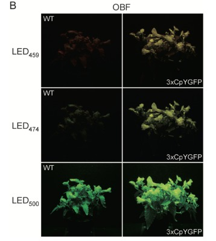
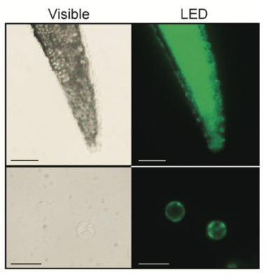

# Week5: Growing more (HLN)
## GMOs

### Homework
・ Find and describe 3 genetically modified organisms 
・ Describe the traits 
・ Find out the modification methods 
・ Extra credit: find gene/gene sequence that has been changed 
 
1. Trenia (Torenia fournieri Lind) 
 
 
 
In 2014, the trenias which are improved to shine by genetic modification were shown in the National Museum of Nature and Science, Tokyo. The National Agriculture and Food Research Organization (NARO), Tsukuba, Ibaraki Prefecture, developed it. This is the first achievement that uses fluorescent proteins, not for the observations in micro-scale such as "the analysis of intracellular localization and protein–protein interaction," but for "for macro level observations of tissues or of the whole plant" as fluorescent flowers(Sasaki et al. 2014:309). 
 
**How?** 
They induced a coding sequence of a yellowish green fluorescent protein from the marine plankton Chiridius poppei (CpYGFP) into trenia's DNA. 
 
**References** 
- [https://scienceportal.jst.go.jp/newsflash/20141125_03/index.html](https://scienceportal.jst.go.jp/newsflash/20141125_03/index.html) 
- [遺伝子組換え技術により開発された「光る花」の論文を公開](https://www.naro.go.jp/publicity_report/press/laboratory/flower/054854.html) 
- [(Original article from Researchgate)Generation of fluorescent flowers exhibiting strong fluorescence by combination of fluorescent protein from marine plankton and recent genetic tools in Torenia fournieri Lind](https://www.researchgate.net/publication/272403245_Generation_of_fluorescent_flowers_exhibiting_strong_fluorescence_by_combination_of_fluorescent_protein_from_marine_plankton_and_recent_genetic_tools_in_Torenia_fournieri_Lind) 
 

2. Oilseed Rape （ナタネ／セイヨウアブラナ） 
Many oilseed rape were genetically modified for herbicide and pest resistance. They have  
除草剤の成分GlyphosateやGlufosinateに対して耐性を持つ
 
**How?** 
セイヨウアブラナに除草剤耐性遺伝子や抗生物質耐性遺伝子を組み込んだもの 
 
**References** 
（・・・・・・・・・） 
- [除草剤グルホシネート耐性及び稔性回復性セイヨウナタネ(改変bar, barstar, Brassica napus L.)(RF3, OECD UI :ACS-BNØØ 3-6)申請書等の概要](https://www.env.go.jp/info/iken/h190301a/a-5.pdf) 
- [Sampling test](https://earlybirds.ddo.jp/bunseki/topics/gmotest/gmotest3.html) 
- [Genetically modified oilseed rape monitoring (in Japan)](https://www.nies.go.jp/biology/en/research/frame/gm.html) 
 
- [Genetically modified food - Ministry of Health Labor and Welfare](https://www.mhlw.go.jp/stf/seisakunitsuite/bunya/kenkou_iryou/shokuhin/bio/idenshi/index.html) 
 

3. Silkworm 
 
Silkworms have the ability to produce proteins by their threads. Using the ability, genetically modified silkworms are developed for the purpose to produce specific proteins: collagen, fibrinogen, albumin, GFP, etc.. This is a low-cost and efficient way of producing proteins. The modified silk is applied for cosmetics and pharmaceuticals. 
 
**How?** 
Scientists of technicians who work on the modification, they insert the target gene into the expression vector, inject the DNA into the portion of the egg by using microscope and a tiny needle. 
 
 
(The image is cited from [here](https://www.nippon.com/en/features/c00508/)) 
 
**References** 
- [遺伝子組換えカイコによるタンパク質受託発現](https://www.ozeki.co.jp/food_bio/protein_expression/silkworm.html) 
- [【農業生物資源研究所】遺伝子組換えカイコで医薬開発に挑戦](https://www.nippon.com/ja/features/c00508/amp/) 
- [Using Genetically Modified Silkworms to Develop Cheaper Drugs](https://www.nippon.com/en/features/c00508/)
 
